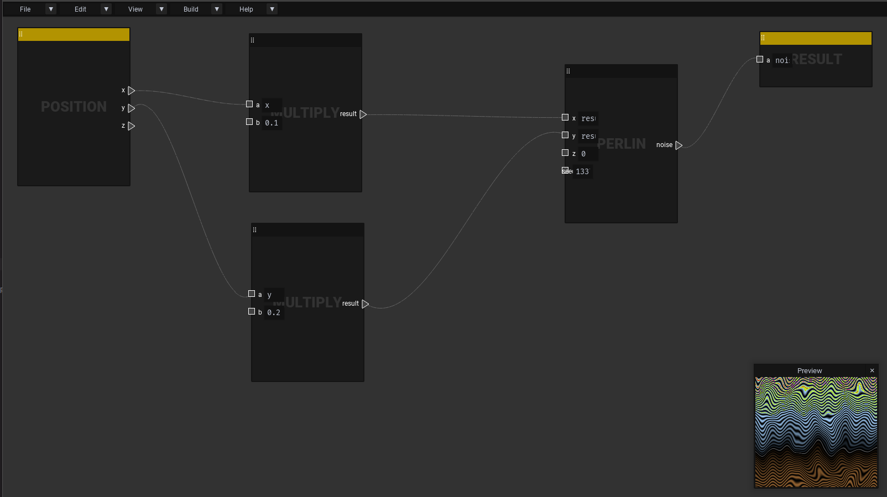
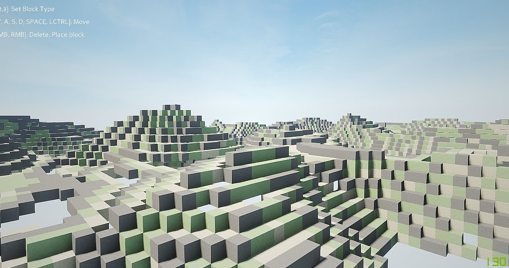

# SquarerFive
Stuff I've been working on:

## [Cesium - Procedural Foliage Tutorial](https://cesium.com/learn/unreal/unreal-procedural-foliage/)
- 

## Procedural universe
- ### Planet generation using Voxels - https://github.com/SquarerFive/PlanetSphericalProjection
  - 
- ### SDF Node Graph - this is a headless graph I made for my school project to generate a 3D world either on the GPU (by compiling a CUDA kernel at runtime) or CPU. Planned RUST remake: https://github.com/SquarerFive/fast_nodes
  - 
  - Voxel world generated on the GPU using the graph.
  - 
